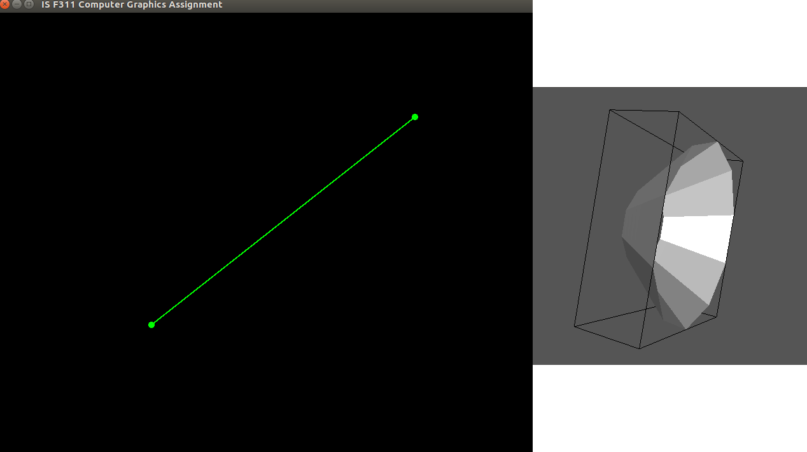

# Bezier Curves and Surfaces

Bezier curves are a parametric formulation of curves. It uses something called a "*control polygon*" for deciding the shape of the curve. The number of vertices in this control polygon is associated with the degree of the equation of the bezier curve. A control polygon with 4 vertices gives a bezier curve of degree 3 (cubic curve).

We are using the ***De Casteljau algorithm*** for drawing bezier curves of any degree.

### De Casteljau algorithm
This is a recursive algorithm to calculate points on a bezier curve. It works by recursively linearly interpolating between control points with some parameter, `t`. This parameter ranges linearly from 0 to 1. Since the number of points in the curve cannot be infinite, the parameter, `t`, is incremented by a small value at every step. We have chosen a step value of `0.001`. This means that each curve will have 1000 points.

*- A bezier curve with 3 control points*

### Surfaces of revolution
The bezier curve is in the `x-y plane`. We can form a surface of revolution by revolving each point along a circle with the x-axis as the axis of teh cirlce.

We define the following:

1. **Axis of rotation**:         (1, 0, 0)
2. **Binormal to bezier curve**: (0, 0, 1)
3. **Circle of rotation**: (0, r \* cos(2 \* PI \* t), r \* sin(2 \* PI\*t))
4. **Tangent to the circle of rotation**: (0, r \* -sin(2 \* PI \* t), r \* cos(2 \* PI\*t))

For each point on the curve, the following is required:

1. Translate the point to by **(0, r \* cos(2 \* PI \* t), r \* sin(2 \* PI\*t))**
2. Rotate along the axis of rotation by an angle of **arccos(dot(Bezier curve binormal, circle tangent))**

Once these transformations are applied to all points on the line, they can be saved in a mesh data structure.

### OFF files
Once a mesh is generated, as described above, it can be saved to file. There are multiple formats used to save polygonal meshes. The one we are using is the **OFF file format**. This contains an vertex list and an indexed face list, which contains data about the ordering of vertices in the face.

### Geomview

We used a software called **Geomview** for visualizing the OFF file of the mesh. It reconstructs and renders the mesh from the OFF file.

It allows us to change material properties, lighting, color, etc.

We can also view the mesh in different modes, such as wireframe.

### Results

### Contributors
* Pranav Asthana
* Arnav Dhamija
* Bhavathi Reddy
